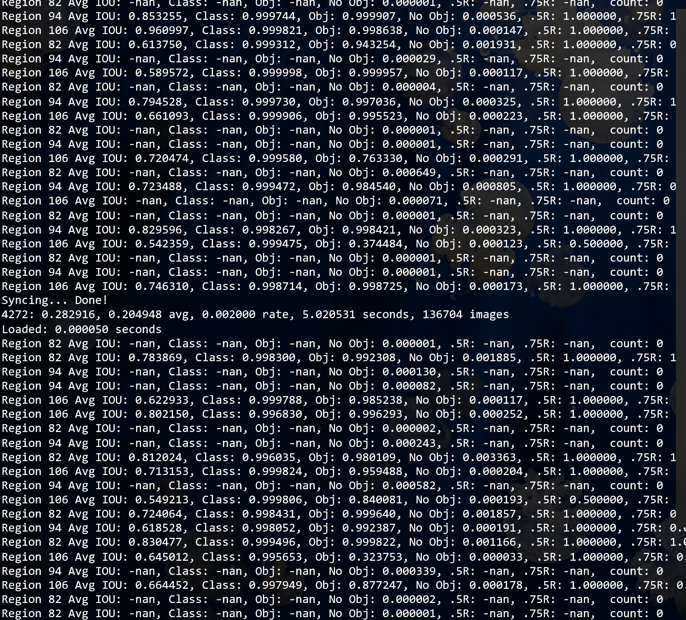

# keras-retinanet

> Keras 实现的RetinaNet目标检测算法 [GitHub](https://github.com/fizyr/keras-retinanet).

### 安装
请查看其项目主页按照说明步骤安装，推荐在预配深度学习框架环境的 [Azure DSVM](https://azure.microsoft.com/en-us/services/virtual-machines/data-science-virtual-machines/) 的虚机上安装调试项目.
- 克隆项目
```
https://github.com/fizyr/keras-retinanet.git
```
- 执行安装
在项目目录下执行`pip install . --user`。安装完成后可以直接以`keras-retinanet`这个命令在命令行下调用。
> 也可以不执行安装，但是每次需要在项目的`bin`目录下执行`train.py`文件，如果对某个文件进行了修改，只能以这种方式运行。

- 运行测试

安装完成后，请打开其项目中`examples`目录下的Jupyter Notebook测试。请确保Jupyter Notebook中的各种文件路径的正确性。一种可行的做法是把`examples`下的Jupyter Notebook文件复制到本机的Jupyter Notebook 主目录下，在DSVM中该目录一般在用户目录下的`notebook`目录中，通过Jupyter Notebook 的portal直接打开该文件。随和更改Jupyter Notebook中所需模型、样例文件的路径即可得到测试结果。可以对照Github项目中对应的文件，如果没有显著差别即可开始进行随后的训练。

### 在 Pascal VOC 数据集上训练
#### Pascal VOC 2007数据下载
```
wget http://host.robots.ox.ac.uk/pascal/VOC/voc2007/VOCtrainval_06-Nov-2007.tar
wget http://host.robots.ox.ac.uk/pascal/VOC/voc2007/VOCtest_06-Nov-2007.tar
wget http://host.robots.ox.ac.uk/pascal/VOC/voc2007/VOCdevkit_08-Jun-2007.tar
```


```
# 执行以下命令将解压到一个名为VOCdevkit的目录中
tar xvf VOCtrainval_06-Nov-2007.tar
tar xvf VOCtest_06-Nov-2007.tar
tar xvf VOCdevkit_08-Jun-2007.tar
```


#### 预训练模型下载
前往项目release[页面](https://github.com/fizyr/keras-retinanet/releases/)下载预训练模型，训练要在此模型基础上进行。下载文件名类似于resnet50_coco_best_v2.1.0.h5的模型保存到`/keras_retinanet/snapshots/`目录下。

#### 训练
```
# train
# 如果没有执行前面的安装，可以使用形如下面命令开始训练
python keras_retinanet/bin/train.py pascal /path/to/VOCdevkit/VOC2007

# 如果执行过安装并且没有修改过其中的文件，可以使用下面的命令开始训练
retinanet-train pascal /path/to/VOCdevkit/VOC2007

# 使用 --backbone=xxx 选择网络结构，默认是resnet50

# xxx可以是resnet模型（`resnet50`，`resnet101`，`resnet152`）
# 或`mobilenet`模型（`mobilenet128_1.0`，`mobilenet128_0.75`，`mobilenet160_1.0`等）

# 也可以使用models目录下的 resnet.py，mobilenet.py等来自定义网络
```
在训练一个Epoch之后对验证集的指标输出如下：
```
aeroplane 0.0663
bicycle 0.1130
bird 0.1154
boat 0.0122
bottle 0.1450
bus 0.0796
car 0.4602
cat 0.1525
chair 0.1744
cow 0.1389
diningtable 0.0340
dog 0.1247
horse 0.1359
motorbike 0.0644
person 0.5190
pottedplant 0.0097
sheep 0.0767
sofa 0.0581
train 0.0745
tvmonitor 0.2770
mAP: 0.1416
```
为了能查看在训练集上的`mAP`,需要对`keras_retinanet/train.py`文件稍作修改。
```python
    # create the callbacks
    callbacks = create_callbacks(
        model,
        training_model,
        prediction_model,
        validation_generator,
        args,
    )

    # start training
    training_model.fit_generator(
        generator=train_generator,
        steps_per_epoch=args.steps,
        epochs=args.epochs,
        verbose=1,
        callbacks=callbacks,
    )
```
代码会在每一个Epoch结束之后调用 callbacks回调函数，使用这一轮训练得到的模型在验证集上计算各项指标。这里只能看到在验证集上的指标，为了能看到在训练集上的指标，修改create_callbacks函数。
在函数参数中增加一个参数`train_generator` 以传入训练集。
```python
def create_callbacks(model, training_model, prediction_model, validation_generator, args,train_generator = None):
```
对第二个if语句做如下修改：

```python
    if args.evaluation and validation_generator:
        if args.dataset_type == 'coco':
            from ..callbacks.coco import CocoEval

            # use prediction model for evaluation
            evaluation = CocoEval(validation_generator, tensorboard=tensorboard_callback)
        else:
            evaluation = Evaluate(validation_generator, tensorboard=tensorboard_callback)
            if train_generator != None:
                evalution2 = Evaluate(train_generator, tensorboard=tensorboard_callback)
        evaluation = RedirectModel(evaluation, prediction_model)
        evaluation2 = RedirectModel(evaluation2, prediction_model)
        callbacks.append(evaluation)
        callbacks.append(evaluation2)
```

重新训练，将在验证集输出指标后得到对训练集的指标输出：
> 注意：因为对代码进行了修改，训练时需要使用`train.py`进行训练，而不是使用安装后的命令`retinanet-train`训练。
使用`python keras_retinanet/bin/train.py pascal /path/to/VOCdevkit/VOC2007`进行训练。

```
aeroplane 0.1251
bicycle 0.2028
bird 0.1530
boat 0.0159
bottle 0.2004
bus 0.0661
car 0.4618
cat 0.1917
chair 0.2001
cow 0.0910
diningtable 0.0408
dog 0.1378
horse 0.1532
motorbike 0.0791
person 0.5489
pottedplant 0.0126
sheep 0.0484
sofa 0.0716
train 0.0805
tvmonitor 0.3508
mAP: 0.1616
```

#### 测试
训练完成后，会在`snapshots`目录下保存模型。测试还是在上面提到的Jupyter Notebook中进行，需要修改其中的标签为VOC存在的标签如下。
```
'diningtable', 'person', 'bottle', 'boat', 'train', 'bird', 'dog', 'cat', 'tvmonitor', 'cow', 'car', 'sofa', 'horse', 'chair', 'pottedplant', 'bicycle', 'motorbike', 'aeroplane', 'sheep', 'bus'
```
并且将模型路径改为`snapshots`目录下最新的模型，选择一张VOC中的图片执行测试即可。

### 在自己的数据上训练

#### 数据预处理
这里使用CSV文件格式标注数据集，如有已有VOC 2007数据集格式的数据可以使用下面的`pascal2csv.py`进行转换。对于具体数据集，可能需要对此文件稍作修改后才能使用。
```python
# -*- coding:utf-8 -*-
 
import csv
import os
import glob
import sys
 
class PascalVOC2CSV(object):
    def __init__(self,xml=[], ann_path='./annotations.csv',classes_path='./classes.csv'):
        '''
        :param xml: 所有Pascal VOC的xml文件路径组成的列表
        :param ann_path: ann_path
        :param classes_path: classes_path
        '''
        self.xml = xml
        self.ann_path = ann_path
        self.classes_path=classes_path
        self.label=[]
        self.annotations=[]
 
        self.data_transfer()
        self.write_file()
 
 
    def data_transfer(self):
        for num, xml_file in enumerate(self.xml):
            try:
                # print(xml_file)
                # 进度输出
                sys.stdout.write('\r>> Converting image %d/%d' % (
                    num + 1, len(self.xml)))
                sys.stdout.flush()
 
                with open(xml_file, 'r') as fp:
                    for p in fp:
                        if '<filename>' in p:
                            self.filen_ame = p.split('>')[1].split('<')[0]
 
                        if '<object>' in p:
                            # 类别
                            d = [next(fp).split('>')[1].split('<')[0] for _ in range(9)]
                            self.supercategory = d[0]
                            if self.supercategory not in self.label:
                                self.label.append(self.supercategory)
 
                            # 边界框
                            x1 = int(d[-4]);
                            y1 = int(d[-3]);
                            x2 = int(d[-2]);
                            y2 = int(d[-1])
 
                            self.annotations.append([os.path.join('JPEGImages',self.filen_ame),x1,y1,x2,y2,self.supercategory])
            except:
                continue
 
        sys.stdout.write('\n')
        sys.stdout.flush()
 
    def write_file(self,):
        with open(self.ann_path, 'w', newline='') as fp:
            csv_writer = csv.writer(fp, dialect='excel')
            csv_writer.writerows(self.annotations)
 
        class_name=sorted(self.label)
        class_=[]
        for num,name in enumerate(class_name):
            class_.append([name,num])
        with open(self.classes_path, 'w', newline='') as fp:
            csv_writer = csv.writer(fp, dialect='excel')
            csv_writer.writerows(class_)
 
 
xml_file = glob.glob('./Annotations/*.xml')
 
PascalVOC2CSV(xml_file)
```
上面的函数运行完成后会在目录下产生`classes.csv`和`annotations.csv`文件。retinanet所需要的这两个CSV标注文件格式如下。这里使用了只有一个目标类别的数据集。
##### annotations.csv
```
格式为 path/to/image.jpg,x1,y1,x2,y2,class_name

JPEGImages/434140.jpg,348,197,357,206,helmet
JPEGImages/434140.jpg,391,208,401,219,helmet
JPEGImages/434922.jpg,309,181,354,213,helmet
JPEGImages/434947.jpg,269,421,371,492,helmet  #图片第一个对象
JPEGImages/434947.jpg,202,245,242,268,helmet  #图片第二个对象
JPEGImages/434947.jpg,265,272,286,290,helmet
```
#### classes.csv
这里只有一个目标类别，id从0开始，如果有多个目标依次递增即可。
```
格式为 class_name,id
helmet,0
```
数据处理完成后，目录结构如下。

annotations.csv  # 必须

classes.csv # 必须

JPEGImages  # （可选），这样 annotations.csv可以使用图片的相对路径       
└─ *.jpg


#### 训练
```python
# Running directly from the repository:
python train.py --epoch=50 --steps=250 --gpu=0 csv ./helmet_images_labeled/annotations.csv ./helmet_images_labeled/classes.csv
 
# 使用 --backbone=xxx 选择网络结构，默认是resnet50
 
# xxx可以是resnet模型（`resnet50`，`resnet101`，`resnet152`）
# 或`mobilenet`模型（`mobilenet128_1.0`，`mobilenet128_0.75`，`mobilenet160_1.0`等）
 
# 也可以使用models目录下的 resnet.py，mobilenet.py等来自定义网络
```
训练过程输出如下。

每一个epoch的模型保存在`snapshots`目录下。
#### 测试
选择一个满意的模型，使用下面的命令，将训练模型转换为可供测试的模型。
```
retinanet-convert-model /path/to/training/model.h5 /path/to/save/inference/model.h5
```
在ResNet50RetinaNet.ipynb文件中，修改对应类别，类别顺序需要和`classes.csv`对应。
```python
# load label to names mapping for visualization purposes
class_name=['helmet']
class_name=sorted(class_name)
labels_to_names=dict(zip(range(len(class_name)),class_name)) 
```
测试结果如下图。


如果要在整个数据集上统计mAP使用如下命令，其中模型为经过转换的模型。
```
python evaluate.py csv /home/lin/helmet_images_labeled/annotations.csv /home/lin/helmet_images_labeled/classes.csv model.h5
```
可以在后面加上可选参数 `iou-threshold==0.6`,默认为0.5，这个值越大检测越严格，检测到的目标就越少。

#### retinanet 训练参数调整
在执行训练时，可以指定一些训练参数。这些参数在`keras_retinanet/train.py`文件的`parse_args`函数中有说明，可根据具体场景指定。
- epoch 指定训练的轮数,对于较大的数据集(数千张图片)需要很大的值，例如10,000轮
- steps 指定每个epoch的步长，一个步长为一张图片
- gpu 指定使用GPU计算，参数为0,1等GPU序号
- snapshot 指定从一个先前的快照继续训练

IOU（交并比）参数在于`train.py`文件中的`create_callbacks`函数调用到的`Evaluate`函数参数中设置，可以查看`callbacks/eval.py`文件查看用法，默认为0.5，这个值越大检测越严格，检测到的目标就越少。

# Yolo v3

Yolo 目标检测算法，原作者项目[主页](https://pjreddie.com/darknet/yolo/).

## 安装
如果在仅有CPU的计算机上运行，可直接运行下面的代码，克隆并编译Yolov3项目：

```shell
git clone https://github.com/pjreddie/darknet
cd darknet
make
```
如果计算机能够使用GPU，则需要先对Makefile文件进行编辑。将其中的GPU变量设置为1，CUDNN也设置为1后保存。保持后在该目录下执行make命令编译。
```makefile
GPU=1
CUDNN=1
OPENCV=0
OPENMP=0
DEBUG=0
```

编译完成后将会生成一个可执行文件`darknet`。下面使用预训练模型测试。首先下载权重文件：

```shell
wget https://pjreddie.com/media/files/yolov3.weights
```

运行测试：

```shell
./darknet detect cfg/yolov3.cfg yolov3.weights data/dog.jpg
```

将会看到如下输出：

```
layer     filters    size              input                output
    0 conv     32  3 x 3 / 1   416 x 416 x   3   ->   416 x 416 x  32  0.299 BFLOPs
    1 conv     64  3 x 3 / 2   416 x 416 x  32   ->   208 x 208 x  64  1.595 BFLOPs
    .......
  105 conv    255  1 x 1 / 1    52 x  52 x 256   ->    52 x  52 x 255  0.353 BFLOPs
  106 detection
truth_thresh: Using default '1.000000'
Loading weights from yolov3.weights...Done!
data/dog.jpg: Predicted in 0.029329 seconds.
dog: 99%
truck: 93%
bicycle: 99%
```
在当前目录下将生成一个predictions.png文件，该文件中将会标出识别到的物体。如果目标标注不符合预期请重新检查错误或重新编译。

如果需要连续在多个图像文件上进行识别，可以采用如下的方式：
```
./darknet detect cfg/yolov3.cfg yolov3.weights
```
此命令将提示输入需要检测的图像文件路径，如果需要退出按Ctrl+C。

### 更改检测门限值

默认将对执行度大于0.25的物体进行标注，可以加入thresh参数自定义该门限值，例如将其置为0后会将所有检测到的物体标出。
```
./darknet detect cfg/yolov3.cfg yolov3.weights data/dog.jpg -thresh 0
```
### Tiny Yolov3
这是一个比Yolov3小很多的模型，对一些受限的条件下可能会用得到。首先下载模型。
```
wget https://pjreddie.com/media/files/yolov3-tiny.weights
```
运行检测。
```
./darknet detect cfg/yolov3-tiny.cfg yolov3-tiny.weights data/dog.jpg
```

## 在VOC上训练
获取 Pascal VOC 数据
```
wget https://pjreddie.com/media/files/VOCtrainval_11-May-2012.tar
wget https://pjreddie.com/media/files/VOCtrainval_06-Nov-2007.tar
wget https://pjreddie.com/media/files/VOCtest_06-Nov-2007.tar
tar xf VOCtrainval_11-May-2012.tar
tar xf VOCtrainval_06-Nov-2007.tar
tar xf VOCtest_06-Nov-2007.tar
```
命令执行完之后会生成一个VOCdevkit目录，包含了Pascal VOC 数据。
随后将数据标签转化为Darknet能使用的标签文件。
```
wget https://pjreddie.com/media/files/voc_label.py
python voc_label.py
```
命令执行完后将在VOC数据集下生成labels文件夹和下面五个文件。
```
2007_test.txt
2007_train.txt
2007_val.txt
2012_train.txt
2012_val.txt
```
将这些文件合并。
```
cat 2007_train.txt 2007_val.txt 2012_*.txt > train.txt
```
修改 Pascal 数据配置文件。打开`cfg/voc.data`文件。
```
  classes= 20
  train  = <path-to-voc>/train.txt
  valid  = <path-to-voc>/2007_test.txt
  names = data/voc.names
  backup = backup
``` 
  将<path-to-voc>修改为数据实际位置后保存。

  修改`cfg/yolov3-voc.cfg`文件。将Testing的变量注释，Training的变量取消注释。
  ```
  # Testing
# batch=1
# subdivisions=1
# Training
 batch=64
 subdivisions=8
 ```

  下载预训练权重文件，该文件是Imagenet上的卷积层权重。
 ```
  wget https://pjreddie.com/media/files/darknet53.conv.74
 ```

开始训练模型。
```
  ./darknet detector train cfg/voc.data cfg/yolov3-voc.cfg darknet53.conv.74 -gpus 0
```
训练将会有类似如下的输出。

训练过程中生成的模型在`backup`目录下。模型将会在每100次迭代后连续产生，1000次迭代后每10 000次迭代后保存一次。可根据需要在 `examples/detector.c` 的138行进行修改，修改后重新编译。请注意观察训练输出的误差，在误差满意后手动停止训练。

输出数据含义
- Region xx: cfg文件中yolo-layer的索引；
- Avg IOU:当前迭代中，预测的box与标注的box的平均交并比，越大越好，期望数值为1；
- Class: 标注物体的分类准确率，越大越好，期望数值为1；
- obj: 越大越好，期望数值为1；
- No obj: 越小越好；
- .5R: 以IOU=0.5为阈值时候的recall; recall = 检出的正样本/实际的正样本
- 0.75R: 以IOU=0.75为阈值时候的recall;
- count:正样本数目

## 在自己的数据集上训练
> 首先请将自己的数据集按以下目录结构命名。

/VOC

-VOCdevkit

--  Annotation/ ImageSets/ JPEGImages/ 
  
将VOC格式的xml文件转换成Yolo需要的txt文件，可使用voc_label.py脚本或稍作修改后进行转换。在目录下生成包含训练集图片路径和验证集图片路径的txt文件。

修改`cfg/voc.data`文件,将类别数更改为需要识别的目标数量，以及将train和valid对应相应txt文件路径。
```xml
  classes= 1
  train  = <path-to-own-data>/train.txt
  valid  = <path-to-own-data>/valid.txt
  names = data/voc.names
  backup = backup
``` 

修改`data/voc.names`文件，该文件中是所有类别的标记名称，根据需要改为需要识别的目标名称。

修改`cfg/yolov3-voc.cfg`文件的网络参数。该文件中定义了每一层网络的一些参数，对于不同的任务，需要对其中6层进行修改。文件中有 **3** 个yolo层，将 **每个** yolo层的classes值设置为目标数量，每个yolo层的 **上一个** 卷积层中，将filter的值设置为(classes + 5)x3)，例如需要识别1个目标，那么就将filter设置为18。
```
[convolutional]
size=1
stride=1
pad=1
filters=18
activation=linear

[yolo]
mask = 6,7,8
anchors = 10,13,  16,30,  33,23,  30,61,  62,45,  59,119,  116,90,  156,198,  373,326
classes=1
num=9
jitter=.3
ignore_thresh = .5
truth_thresh = 1
random=1

```
这些文件修改完成后即可开始训练。
```
  ./darknet detector train cfg/voc.data cfg/yolov3-voc.cfg darknet53.conv.74 -gpus 0
```
训练过程中生成的模型在backup目录下。模型将会在每100次迭代后连续产生，1000次迭代后每10 000次迭代后保存一次。可根据需要在 examples/detector.c 的138行进行修改，修改后重新编译。请注意观察训练输出的误差，在误差满意后手动停止训练。

如果训练输出中出现大量 **nan**, 请在`yolov3-voc.cfg`中将训练的batch增大。如果训练数据较少，可以将batch减少，这里为检测一个目标使用的数据不到100张，batch设置为16可得到正确结果。

### 模型测试

在`yolov3-voc.cfg`中把batch和subdivisions设置为1。

``` 
./darknet detector test cfg/voc.data cfg/yolov3-voc.cfg /backup/yolo-voc_final.weights img.jpg
```
将会输出检测出的目标类别和置信度，同时在目录下产生predictions.png文件供查看。


### 模型验证

```
 ./darknet detector valid cfg/voc.data cfg/yolov3-voc.cfg backup/yolo-voc_final.weights
```
在终端只返回用时，在./results/comp4_det_test_[类名].txt里保存测试结果。该文件中保存了预测的类别、置信度、bonding box，这些数据可用于统计模型的准确度。

统计mAP的方法参考了[py-faster-rcnn](https://github.com/rbgirshick/py-faster-rcnn/blob/master/lib/datasets/pascal_voc.py),对于具体情况需要作适当修改，参考代码如下。
```python
import xml.etree.ElementTree as ET
import os
import pickle
import numpy as np


def parse_rec(filename):
    """ Parse a PASCAL VOC xml file """
    tree = ET.parse(filename)
    objects = []
    for obj in tree.findall('object'):
        obj_struct = {}
        obj_struct['name'] = obj.find('name').text
        obj_struct['pose'] = obj.find('pose').text
        #obj_struct['truncated'] = int(obj.find('truncated').text)
        #obj_struct['difficult'] = int(obj.find('difficult').text)
        bbox = obj.find('bndbox')
        obj_struct['bbox'] = [int(bbox.find('xmin').text),
                              int(bbox.find('ymin').text),
                              int(bbox.find('xmax').text),
                              int(bbox.find('ymax').text)]
        objects.append(obj_struct)

    return objects


def voc_ap(rec, prec, use_07_metric=False):
    """ ap = voc_ap(rec, prec, [use_07_metric])
    Compute VOC AP given precision and recall.
    If use_07_metric is true, uses the
    VOC 07 11 point method (default:False).
    """
    if use_07_metric:
        # 11 point metric
        ap = 0.
        for t in np.arange(0., 1.1, 0.1):
            if np.sum(rec >= t) == 0:
                p = 0
            else:
                p = np.max(prec[rec >= t])
            ap = ap + p / 11.
    else:
        # correct AP calculation
        # first append sentinel values at the end
        mrec = np.concatenate(([0.], rec, [1.]))
        mpre = np.concatenate(([0.], prec, [0.]))

        # compute the precision envelope
        for i in range(mpre.size - 1, 0, -1):
            mpre[i - 1] = np.maximum(mpre[i - 1], mpre[i])

        # to calculate area under PR curve, look for points
        # where X axis (recall) changes value
        i = np.where(mrec[1:] != mrec[:-1])[0]

        # and sum (\Delta recall) * prec
        ap = np.sum((mrec[i + 1] - mrec[i]) * mpre[i + 1])
    return ap


def voc_eval(detpath,
             annopath,
             imagesetfile,
             classname,
             cachedir,
             ovthresh=0.5,
             use_07_metric=False):
    """rec, prec, ap = voc_eval(detpath,
                                annopath,
                                imagesetfile,
                                classname,
                                [ovthresh],
                                [use_07_metric])
    Top level function that does the PASCAL VOC evaluation.
    detpath: Path to detections
        detpath.format(classname) should produce the detection results file.
    annopath: Path to annotations
        annopath.format(imagename) should be the xml annotations file.
    imagesetfile: Text file containing the list of images, one image per line.
    classname: Category name (duh)
    cachedir: Directory for caching the annotations
    [ovthresh]: Overlap threshold (default = 0.5)
    [use_07_metric]: Whether to use VOC07's 11 point AP computation
        (default False)
    """
    # assumes detections are in detpath.format(classname)
    # assumes annotations are in annopath.format(imagename)
    # assumes imagesetfile is a text file with each line an image name
    # cachedir caches the annotations in a pickle file

    # first load gt
    if not os.path.isdir(cachedir):
        os.mkdir(cachedir)
    cachefile = os.path.join(cachedir, 'annots.pkl')
    # read list of images 获取图像文件路径
    with open(imagesetfile, 'r') as f:
        lines = f.readlines()
    imagenames = [x.strip() for x in lines]
# recs所有框
    recs = {}
    if not os.path.isfile(cachefile):
        # load annots
        for i, imagename in enumerate(imagenames):
            recs[imagename[-10:-4]
                 ] = parse_rec(annopath.format(imagename[-10:-4]))
            # recs[imagename] = parse_rec(annopath.format(imagename))
            print(
                'Reading annotation for {:d}/{:d}'.format(i + 1, len(imagenames)))

    # extract gt objects for this class
    # 获得ground truth
    class_recs = {}
    npos = 0
    for imagename in imagenames:
        R = [obj for obj in recs[imagename[-10:-4]] if obj['name'] == classname]
        bbox = np.array([x['bbox'] for x in R])
        difficult = np.array([0]*len(R)).astype(np.bool)
        det = [False] * len(R)
        npos = npos + sum(~difficult)
        class_recs[imagename[-10:-4]
                   ] = {'bbox': bbox, 'difficult': difficult, 'det': det}

    # read dets
    detfile = detpath.format(classname)
    with open(detfile, 'r') as f:
        lines = f.readlines()
# 读取预测值
    splitlines = [x.strip().split(' ') for x in lines]
    image_ids = [x[0] for x in splitlines]
    confidence = np.array([float(x[1]) for x in splitlines])
    BB = np.array([[float(z) for z in x[2:]]
                   for x in splitlines])  # 获得bonding box
# sort by confidence
    sorted_ind = np.argsort(-confidence)  # 按置信度索引 从高到低
    sorted_scores = np.sort(-confidence)  # 置信度从高到低
    BB = BB[sorted_ind, :]  # 把bonding box按其置信度从高到低排列
    image_ids = [image_ids[x] for x in sorted_ind]  # 把对应图片从高到低

    # go down dets and mark TPs and FPs
    nd = len(image_ids)
    tp = np.zeros(nd)  # true positive
    fp = np.zeros(nd)  # false positive
    for d in range(nd):
        R = class_recs[image_ids[d]]  # 获得对应图片ground truth所有数据
        bb = BB[d, :].astype(float)
        ovmax = -np.inf
        BBGT = R['bbox'].astype(float)  # 获得bonding box ground truth

        if BBGT.size > 0:
            # compute overlaps
            # intersection
            ixmin = np.maximum(BBGT[:, 0], bb[0])
            iymin = np.maximum(BBGT[:, 1], bb[1])
            ixmax = np.minimum(BBGT[:, 2], bb[2])
            iymax = np.minimum(BBGT[:, 3], bb[3])
            iw = np.maximum(ixmax - ixmin + 1., 0.)
            ih = np.maximum(iymax - iymin + 1., 0.)
            inters = iw * ih

            # union
            uni = ((bb[2] - bb[0] + 1.) * (bb[3] - bb[1] + 1.) +
                   (BBGT[:, 2] - BBGT[:, 0] + 1.) *
                   (BBGT[:, 3] - BBGT[:, 1] + 1.) - inters)

            overlaps = inters / uni
            ovmax = np.max(overlaps)  # 找到最大的iou
            jmax = np.argmax(overlaps)  # 第几个iou最大
# 如果iou>阈值
        if ovmax > ovthresh:
            if not R['difficult'][jmax]:
                if not R['det'][jmax]:
                    tp[d] = 1.
                    R['det'][jmax] = 1
                else:
                    fp[d] = 1.
        else:
            fp[d] = 1.

    # compute precision recall
    fp = np.cumsum(fp)
    tp = np.cumsum(tp)
    rec = tp / float(npos)
    # avoid divide by zero in case the first detection matches a difficult
    # ground truth
    prec = tp / np.maximum(tp + fp, np.finfo(np.float64).eps)
    ap = voc_ap(rec, prec, use_07_metric)

    return rec, prec, ap


rec, prec, ap = voc_eval('comp4_det_test_helmet.txt', 'Annotations\{}.xml',
                         'helmet_train.txt', 'helmet', '.')
print('ap=%f' % (ap.tolist()))
```

### 参数调整
#### iou_thresh
IOU门限值在`example/detector.c`的第507行设置，默认为0.5。如果修改，需要重新编译项目，在项目目录下执行如下命令。
```
make clean
make
```

下面列举了`cfg/yolov3-voc.cfg`文件的参数，可根据需要修改。
#### Batch_Size(批尺寸) 
该参数主要用于批梯度下降算法(Batch Gradient Descent)中，批梯度下降算法是每次迭代都遍历批中的所有样本，由批中的样本共同决定最优的方向，Batch_Size 正是批中的样本数量。 
若数据集比较小，可以采用全数据集(Full Batch Learning)的形式，由全数据确定的方向能更好地代表样本总体，从而更准确地朝向极值所在的方向；但该种方式并不适用于大数据集； 
另一个极端是每次只训练一个样本，即Batch_Size=1，每次修正方向以各自样本的梯度方向修正，横冲直撞各自为政，难以达到收敛。 
在合理范围内增大Batch_Size,可以 
1. 提高内存利用率，进而提高大矩阵乘法的并行效率； 
2. 跑完一次epoch（全数据集）所需的迭代次数减少，对于相同数据量的处理速度进一步加快； 
3. 在一定范围内，一般来说Batch_Size越大，其确定的下降方向越准，引起的训练震荡越小。 
盲目增大Batch_Size的坏处： 
1. 超出内存容量； 
2. 跑完一次epoch(全数据集)所需的迭代次数减小，要想达到相同的精度，所需要的epoch数量越多，对参数的修正更加缓慢； 
3. Batch_Size 增大到一定程度，其确定的下降方向已经基本不再变化； 
Batch_Size参数调试： 
大的Batch_Size在显存能允许的情况下收敛速度是比较快的但有时会陷入局部最小的情况；小Batch_Size引入的随机性会更大些，有可能会有更好的效果，但是收敛速度会慢一些；当Batch_Size太小，而类别数又比较多的时候,会导致loss函数震荡而不收敛。具体调试过程中，一般可根据GPU显存，设置为最大，而且一般要求是8的倍数，选择一部分数据，跑几个Batch看看loss是否在变小，再选择合适的Batch_Size。 
每Batch_Size个样本更新一次参数。

#### subdivisions
如果内存不够大，将batch分割为subdivisions个子batch,每个子batch的大小为batch/subdivisions； 
darknet代码中，是将batch/subdivisions命名为batch

#### 冲量-momentum
梯度下降法中一种常用的加速技术，可以起到加速收敛的作用，冲量的建议配置为0.9。

#### 权值衰减-weight decay 
使用的目的是防止过拟合，当网络逐渐过拟合时网络权值往往会变大，因此，为了避免过拟合，在每次迭代过程中以某个小因子降低每个权值，也等效于给误差函数添加一个惩罚项，常用的惩罚项是所有权重的平方乘以一个衰减常量之和。权值衰减惩罚项使得权值收敛到较小的绝对值。

#### angle、saturation、exposure、hue 
- angle：图片角度变化，单位为度，假如angle=5，就是生成新图片的时候随机旋转-5~5度  
- saturation & exposure: 饱和度与曝光变化大小，tiny-yolo-voc.cfg中1到1.5倍，以及1/1.5~1倍  
- hue：色调变化范围,tiny-yolo-voc.cfg中-0.1~0.1  
在每次迭代中，会基于角度、饱和度、曝光、色调产生新的训练图片。

#### 学习率-learning rate
学习率决定了参数移动到最优值的速度快慢，如果学习率过大，很可能会越过最优值导致函数无法收敛，甚至发散；反之，如果学习率过小，优化的效率可能过低，算法长时间无法收敛，也易使算法陷入局部最优（非凸函数不能保证达到全局最优）。合适的学习率应该是在保证收敛的前提下，能尽快收敛。 
设置较好的learning rate，需要不断尝试。在一开始的时候，可以将其设大一点，这样可以使weights快一点发生改变，在迭代一定的epochs之后人工减小学习率。 
在yolo训练中，网络训练160epoches，初始学习率为0.001，在60和90epochs时将学习率除以10。

#### 最大迭代次数-max_batches 
权重更新次数

#### 调整学习率的策略-policy 
调整学习率的policy，有如下policy：CONSTANT, STEP, EXP, POLY，STEPS, SIG, RANDOM

#### 学习率变化时的迭代次数-steps 
根据batch_num调整学习率，若steps=100,25000,35000，则在迭代100次，25000次，35000次时学习率发生变化，该参数与policy中的steps对应；

#### 学习率变化的比率-scales 
相对于当前学习率的变化比率，累计相乘，与steps中的参数个数保持一致；

#### batch_normalize
是否使用批标准化

#### 激活函数-activation 
包括logistic，loggy，relu，elu，relie，plse，hardtan，lhtan，linear，ramp，leaky，tanh，stair

#### anchors 
anchors：预测框的初始宽高，第一个是w，第二个是h，总数量是num*2，YOLOv2作者说anchors是使用K-MEANS获得，其实就是计算出哪种类型的框比较多，可以增加收敛速度，如果不设置anchors，默认是0.5;

#### jitter 
通过抖动增加噪声来抑制过拟合

#### rescore 
可理解为一个开关，非0时通过重打分来调整l.delta（预测值与真实值的差）

#### random(yolo模型训练) 
random为1时会启用Multi-Scale Training，随机使用不同尺寸的图片进行训练,如果为0，每次训练大小与输入大小一致

